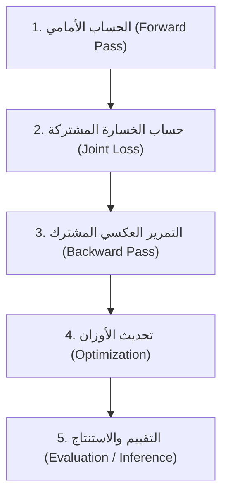

# تقرير بحثي ودليل مناقشة: معمارية الذكاء الاصطناعي لنموذج (JoTouch)

تم إعداد هذا التقرير ليركز بنسبة 100% على البناء البرمجي والرياضي للذكاء الاصطناعي لملف [JoTouch_AI_module.py](file:///c:/Users/aldwy/OneDrive/Desktop/Graduation%20project/JoTouch_AI_module.py)، ليكون مرجعاً علمياً يخدمك في توثيق كتاب مشروع التخرج والاستعداد التام للمناقشة والدفاع أمام لجنة التحكيم.

---

## 1. المبادئ الخمسة لدورة حساب وتدريب الشبكات العصبية (Classification & Regression)

عند التدريب الفعلي لنموذج [JoTouchModel](file:///c:/Users/aldwy/OneDrive/Desktop/Graduation%20project/JoTouch_AI_module.py#L249-L299) متعدد المهام (Multi-Task Learning)، ينفذ الكود دورة حسابية رياضية خماسية الخطوات تجمع بين التصنيف (Classification) والارتداد (Regression):



### 1. الحساب الأمامي (Forward Pass)
*   **آلية العمل:** يأخذ النموذج نافذة الإشارات الخام بأبعاد `[Batch, TIME_STEPS=20, NUM_SENSORS=4]` ويمررها عبر كتل استخلاص الميزات المشتركة (MobileNetV2 + TCN) لإنتاج متجهة تمثيلية موحدة بحجم 64. بعد ذلك، ينقسم تدفق البيانات إلى رأسين متوازيين للإخراج:
    *   **رأس التصنيف (`phase_head`):** يتوقع احتمالات الإيماءة الحركية (تصنيف).
    *   **رأس الارتداد (`angle_head`):** يتوقع قيم مستمرة لزوايا حركة المفاصل بالراديان (ارتداد).
*   **في الكود:** يمثلها التابع `forward(self, x)` داخل كلاس النموذج، ويستدعى في حلقة التدريب كـ: `pred_phase, pred_angle = model(X)`.

### 2. حساب الخسارة المشتركة (Joint Loss Computation)
*   **آلية العمل:** قياس مقدار الخطأ الحاصل في كلتا المهمتين معاً عبر دمج دالتين حسابيتين:
    *   **خسارة التصنيف:** تقيس دقة القبضة عبر دالة الانتروبيا المتقاطعة `nn.CrossEntropyLoss()`.
    *   **خسارة الارتداد:** تقيس دقة زوايا المفاصل عبر دالة متوسط مربع الخطأ `nn.MSELoss()`.
    يتم دمج الخسارتين رياضياً كجمع مرجح مع معامل موازنة ($\lambda = 0.7$) لضمان استقرار تدريب الرأسين:
    $$\text{Loss}_{\text{total}} = \text{Loss}_{\text{phase}} + \lambda \cdot \text{Loss}_{\text{angle}}$$
*   **في الكود:** يتم حسابها في السطر البرمجي: `loss = loss_phase(pred_phase, y_phase)` ويضاف إليها جزء الارتداد المرجح.

### 3. التمرير العكسي المشترك (Backward Pass / Backpropagation)
*   **آلية العمل:** حساب مشتقات وتدرجات الخسارة الإجمالية المشتركة بالنسبة لجميع أوزان الشبكة. تندمج التدرجات القادمة من رأس التصنيف ورأس الارتداد عند وصولها للطبقات المشتركة (Backbone) مما يسمح بتحديث الأوزان بما يخدم المهمتين معاً.
*   **في الكود:** يتم استدعاؤها عبر محرك PyTorch الرياضي تلقائياً بالسطر البرمجي: `loss.backward()`.

### 4. تحديث الأوزان وتحسين المعاملات (Optimization)
*   **آلية العمل:** يقوم المحسن (Optimizer) بتحديث قيم الأوزان والانحيازات في الشبكة العصبية بالاتجاه المعاكس للتدرجات المشتركة لتقليل الخطأ الكلي في الخطوة القادمة.
*   **في الكود:** يمثلها تصفير التدرجات القديمة أولاً `optimizer.zero_grad()` وتطبيق التحديث الفعلي عبر `optimizer.step()`.

### 5. التقييم والاستنتاج (Evaluation / Validation & Inference)
*   **آلية العمل:** قياس كفاءة النموذج على بيانات لم يتدرب عليها من قبل دون حساب التدرجات أو تحديث الأوزان لتوفير الوقت والذاكرة.
*   **في الكود:** تمثلها الدالة `evaluate_model` وكتابة بلوك الاختبار تحت كود `with torch.no_grad():` لحساب دقة التصنيف (Accuracy %) ومتوسط الخطأ المطلق للارتداد (Angle MAE). وفي التشغيل الفعلي (Inference)، يخرج النموذج الإيماءة والزوايا معاً في غضون مللي ثوانٍ معدودة.

---

## 2. شرح معماريات الأجهزة والشبكات المتبناة

قبل مقارنة المعماريات ببدائلها، من المهم فهم المبدأ الهيكلي والبرمجي للشبكتين المستخدمتين في كلاس [JoTouchModel](file:///c:/Users/aldwy/OneDrive/Desktop/Graduation%20project/JoTouch_AI_module.py#L249-L299):

### أ. شبكة MobileNetV2 (كتلة Inverted Residual Block 1D)
*   **تعريف المعمارية:** هي معمارية تلافيفية مصممة للعمل على الأجهزة المدمجة ذات المعالجة المحدودة.
*   **آلية العمل:** تعتمد على تقنية **التلافيف المنفصلة عمقاً (Depthwise Separable Convolutions)**؛ حيث تقسم العملية التلافيفية إلى:
    1.  **Pointwise Conv (1x1):** لتوسيع عدد القنوات الحسابية (Expansion) لاستيعاب ميزات غنية بمعدل تمدد (Expansion Factor = 2).
    2.  **Depthwise Conv:** تطبيق فلتر تلافيف منفرد لكل قناة على حدة لمعالجة البعد الزمني بشكل مستقل دون دمج القنوات (ممثلة بالبارامتر `groups=hidden_dim` في التابع [nn.Conv1d](file:///c:/Users/aldwy/OneDrive/Desktop/Graduation%20project/JoTouch_AI_module.py#L184)).
    3.  **Linear Pointwise Conv (1x1):** إعادة تقليص عدد القنوات (Projection) وتمريرها للمخرج.
*   **اتصال الاختصار المقلوب (Inverted Residual Connection):** يتم جمع المدخلات والمخرجات مباشرة `x + conv(x)` فقط عندما يتطابق عدد القنوات، مما يضمن تدفق التدرجات الحسابية لعمق الشبكة دون ضياع الميزات الأساسية.

### ب. شبكة التلافيف الزمنية (TCN - Temporal Convolutional Network)
*   **تعريف المعمارية:** هي معمارية تلافيفية زمنية مصممة لمعالجة المتسلسلات الزمنية بكفاءة عالية كبديل لشبكات LSTM.
*   **آلية العمل:** تعتمد TCN على تطبيق **التلافيف السببية المتسعة (Dilated Causal Convolutions)**:
    1.  **التلافيف السببية (Causal):** تضمن أن التنبؤ عند الخطوة الزمنية $t$ يعتمد فقط على الخطوات الحالية والسابقة ($t, t-1, ...$) ولا ينظر للمستقبل، مما يطابق السلوك الفيزيائي الفعلي.
    2.  **التلافيف المتسعة (Dilated):** إدخال مسافات فارغة داخل نواة التلافيف بمعدل يتضاعف بشكل أسي (Dilation = 1, 2, ...). هذا يسمح للشبكة بالحصول على **مدى استقبال زمني واسع جداً (Large Receptive Field)** لفهم تاريخ الإشارة الطويل دون زيادة عدد المعاملات أو تعقيد الشبكة.
    3.  **اتصالات التخطي والتوحيد (Residual & BatchNorm):** لضمان استقرار التدريب ومنع تلاشي التدرجات.

---

## 3. المقارنات المعمارية والبدائل (Tables)

### أ. مقارنة معمارية استخلاص الميزات (MobileNetV2 vs. Counterparts)

| وجه المقارنة | كتل MobileNetV2 المتبناة ([InvertedResidual1d](file:///c:/Users/aldwy/OneDrive/Desktop/Graduation%20project/JoTouch_AI_module.py#L164-L206)) **[اختيارنا]** | التلافيف أحادية البعد القياسية (Standard Conv1D) | كتل ريزنت التلافيفية (ResNet Bottleneck Block) | الطبقات الخطية بالكامل (Fully-Connected MLP) |
| :--- | :--- | :--- | :--- | :--- |
| **تقنية التلافيف** | **Depthwise Separable Conv:** تفصل الفلترة المكانية عن دمج القنوات. | **Standard Conv:** تدمج الفلترة والدمج في خطوة واحدة مكثفة. | **Standard Conv with skip:** تلافيف قياسية مع اتصال تخطي. | **لا توجد تلافيف:** اتصالات خطية كاملة بين كل المدخلات والمخرجات. |
| **حجم العمليات الحسابية (FLOPs)** | **منخفض جداً ($O(K \times D_w)$)**. مثالي للحوسبة المحدودة. | **متوسط إلى مرتفع ($O(K \times C_{in} \times C_{out})$)**. | **مرتفع جداً** بسبب عمق الطبقات وحجم التلافيف القياسية. | **مرتفع أضعافاً مضاعفة** مع زيادة طول النافذة الزمنية. |
| **عدد المعاملات (Parameters)** | **صغير جداً** (يسمح بحفظ النموذج داخل ذاكرة الفلاش للمتحكم). | **متوسط** (يستهلك مساحة أكبر ويسبب بطء النقل). | **كبير** (يصعب تكميمه وتشغيله على معالجات الحافة). | **كبير جداً** مما يسبب مشكلة انفجار حجم النموذج (Model Size). |
| **مقاومة الفرط في التخصيص** | **عالية جداً** بفضل قلة الأوزان واستخدام BatchNorm المدمج. | **متوسطة**؛ تتطلب استخدام تنظيم مكثف لمنع الحفظ. | **عالية** ولكن على حساب تعقيد الحسابات وعدد المعاملات. | **سيئة جداً**؛ تميل لحفظ عينات التدريب وتفشل عند اختبارها. |
| **هل هو الاختيار الأفضل للمشروع؟** | **نعم بلا منازع؛** لأنه يحقق أعلى دقة ميزات مكانية بأقل استهلاك للطاقة والذاكرة، مما يجعله الأنسب لبيئة التشغيل المدمجة. | **لا؛** لأنه يهدر طاقة المعالجة في حسابات مكررة لا تفيد مع 4 قنوات FMG فقط. | **لا؛** ثقيل ومعقد حسابياً بدون أي عائد فعلي في الدقة لهذه المهمة. | **لا؛** يفقد التوزيع المكاني الهندسي للمستشعرات ويسهل خداعه بتغير موضع الذراع. |

---

### ب. مقارنة معمارية النمذجة الزمنية (TCN vs. Alternatives)

| وجه المقارنة | الشبكة التلافيفية الزمنية (TCN) **[اختيارنا]** | شبكات الذاكرة قصيرة المدى (LSTM / GRU) | الشبكات المتكررة التقليدية (Simple RNN) | محولات الانتباه (Transformers / Self-Attention) |
| :--- | :--- | :--- | :--- | :--- |
| **طبيعة المعالجة** | **متوازية بالكامل (Parallel):** تعالج النافذة الزمنية كلها دفعة واحدة. | **متسلسلة (Sequential):** تعالج خطوة بخطوة عبر الزمن ($t-1$ ثم $t$). | **متسلسلة (Sequential):** تعاني من بطء التحديث المتتالي. | **متوازية ولكن معقدة:** تعتمد على مصفوفات الانتباه الذاتي لجميع النقاط. |
| **زمن الاستجابة على الحافة (Inference Latency)** | **ثابت وضئيل جداً (<1ms):** عمليات تلافيفية سريعة تدعمها المعالجات الميكروية. | **متغير وبطيء نسبياً:** بسبب الحلقات المتكررة وعمليات البوابات المتعددة. | **متوسط** ولكن مع دقة منخفضة جداً في السلاسل الزمنية. | **بطيء ومكلف حسابياً:** يتطلب حساب مصفوفة الانتباه المربعة ($O(L^2)$). |
| **التحكم بالمدى الزمني (Receptive Field)** | **دقيق ومرن:** يتم التحكم فيه عبر حجم النواة (Kernel) والتساع (Dilation). | **غير مباشر:** يعتمد على قدرة خلايا الذاكرة على الاحتفاظ بالمعلومات. | **محدود جداً** ويصعب الاحتفاظ بالمعلومات لأكثر من 5 خطوات. | **كامل** ولكن غير فعال للأنظمة ذات النوافذ القصيرة (20 خطوة). |
| **استهلاك ذاكرة الوصول العشوائي (RAM)** | **منخفض جداً:** لا تحتاج لحفظ متجهات الحالة الخفية (Hidden States) في كل خطوة. | **مرتفع:** يجب تخصيص ذاكرة للاحتفاظ بمتجهات الحالات الخفية ($h_t, c_t$). | **متوسط** مع تدهور الأداء. | **مرتفع جداً** لتخزين مصفوفات الانتباه المتبادل والترتيب الموضعي. |
| **هل هو الاختيار الأفضل للمشروع؟** | **نعم؛** لأن TCN يعطي معالجة زمنية حتمية وسريعة، وهو ما يحتاجه الطرف الصناعي للاستجابة اللحظية لحركة المستخدم دون تأخير تراكمي. | **لا؛** لأن معالجتها المتسلسلة تسبب عنق زجاجة (Bottleneck) يرفع زمن التأخير الكلي للنظام. | **لا؛** لفقدانها الدقة الرياضية وتلاشي تدرجاتها بسرعة كبيرة. | **لا؛** حجمها وحساباتها تفوق إمكانيات معالج Teensy 4.0 وتتطلب طاقة تشغيل ضخمة. |

---

## 4. الميزات الهندسية والوظائف المتقدمة المستخدمة في الكود

يحتوي ملف الكود على ضبط ميكاترونيكي ذكي يتجلى في اختيار دوال وخصائص رياضية متميزة:

### 1. خوارزمية التحسين [AdamW](file:///c:/Users/aldwy/OneDrive/Desktop/Graduation%20project/JoTouch_AI_module.py#L361) (Adaptive Moment Estimation with Weight Decay)
*   **الميزة والوظيفة:** تقوم بفصل معامل تلاشي الأوزان (Weight Decay) عن حسابات العزم اللحظي المتكيف. في خوارزمية Adam التقليدية، يتم خلط تلاشي الأوزان مع التدرجات مما يقلل من فعالية التنظيم الرياضي.
*   **الأهمية للمشروع:** يمنع الأوزان من التضخم، مما يحسن بشكل كبير من قدرة النموذج على التعميم على عينات لم يرها من قبل (Generalization) ويمنع الفرط في التخصيص.

### 2. جدولة معدل التعلم [OneCycleLR](file:///c:/Users/aldwy/OneDrive/Desktop/Graduation%20project/JoTouch_AI_module.py#L362-L364) (One Cycle Learning Rate Policy)
*   **الميزة والوظيفة:** تبدأ بمعدل تعلم منخفض، ثم ترفعه بشكل تدريجي في الثلث الأول من التدريب ليخترق العقبات والحدود المحلية (Local Minima)، ثم تخفضه ببطء شديد حتى يقترب من الصفر في نهاية التدريب ليحقق الاستقرار في أعمق نقطة تقارب.
*   **الأهمية للمشروع:** تحقق ظاهرة **"التقارب الفائق" (Super-convergence)**، مما يقلل من عدد Epochs المطلوبة للتدريب، ويوفر وقتاً ضخماً أثناء إعادة معايرة النموذج للمريض.

### 3. دالة التفعيل [SiLU / Swish](file:///c:/Users/aldwy/OneDrive/Desktop/Graduation%20project/JoTouch_AI_module.py#L178) (Sigmoid Linear Unit)
*   **الميزة والوظيفة:** معادلته الرياضية $f(x) = x \cdot \sigma(x)$. على عكس دالة ReLU التقليدية التي تقطع القيم السالبة تماماً وتسبب مشكلة "موت العصبونات" (Dying ReLU)، فإن SiLU دالة ناعمة وغير رتيبة (Smooth and Non-monotonic) وتسمح بمرور تدرجات خفيفة للقيم السالبة.
*   **الأهمية للمشروع:** تساعد في استقرار تدريب الشبكات العميقة وتحسين دقة التصنيف للإشارات البيولوجية غير الخطية مثل FMG.

### 4. التقييد المسبق للتدرج [clip_grad_norm_](file:///c:/Users/aldwy/OneDrive/Desktop/Graduation%20project/JoTouch_AI_module.py#L385) (Gradient Clipping)
*   **الميزة والوظيفة:** تقييد القيمة القصوى للمعيار الإجمالي للتدرجات لمنعها من التضخم المفاجئ (Exploding Gradients).
*   **الأهمية للمشروع:** يضمن استقرار عملية التدريب ويمنع حدوث تشوهات مفاجئة في أوزان النموذج عند حدوث طفرات غير متوقعة في إشارات المستشعرات.

### 5. الإيقاف المبكر [Early Stopping](file:///c:/Users/aldwy/OneDrive/Desktop/Graduation%20project/JoTouch_AI_module.py#L412-L436) (مع عامل Patience)
*   **الميزة والوظيفة:** يراقب خسارة التحقق (Validation Loss)، فإذا توقفت عن التحسن لعدد محدد من Epochs (مثلاً 10 دورات)، ينهي التدريب تلقائياً ويسترجع أفضل أوزان تم تسجيلها.
*   **الأهمية للمشروع:** يحمي النموذج من التدهور والفرط في التخصيص، ويوفر استهلاك موارد الحوسبة.

### 6. اختبار زمن الاستجابة الفعلي [test_latency](file:///c:/Users/aldwy/OneDrive/Desktop/Graduation%20project/JoTouch_AI_module.py#L476-L500)
*   **الميزة والوظيفة:** تمرير عينة وهمية (Dummy Batch) لـ 100 مرة متتالية على وحدة المعالجة الحالية (GPU/CPU) وحساب متوسط زمن المعالجة بالملي ثانية.
*   **الأهمية للمشروع:** التحقق الهندسي من كفاءة النموذج وسرعته قبل ترحيله للمتحكم الدقيق للتحقق من تلبيته لشروط الزمن الحقيقي (Real-time compatibility).

---

## 5. التفاصيل البنيوية ومسار البيانات لنموذج JoTouch

يوضح المخطط التالي كيفية تدفق البيانات والتحولات الهندسية للأبعاد داخل كلاس [JoTouchModel](file:///c:/Users/aldwy/OneDrive/Desktop/Graduation%20project/JoTouch_AI_module.py#L249-L299):

```
المدخلات الخام: نافذة زمنية من إشارات المستشعرات الأربعة
الأبعاد: [Batch, Time_Steps=20, Sensors=4]
                 │
                 ▼ (التحويل البعدي عبر permute)
الأبعاد الجديدة: [Batch, Sensors=4, Time_Steps=20]
                 │
                 ▼ (توسيع القنوات عبر Conv1d)
الأبعاد الجديدة: [Batch, Channels=32, Time_Steps=20]
                 │
                 ▼ (كتلة MobileNetV2 الأولى: InvertedResidual1d)
الأبعاد الجديدة: [Batch, Channels=32, Time_Steps=20]  (مع بقاء الأبعاد ثابتة للاستفادة من مسار الاختصار)
                 │
                 ▼ (كتلة MobileNetV2 الثانية: InvertedResidual1d)
الأبعاد الجديدة: [Batch, Channels=64, Time_Steps=20]  (زيادة القنوات لاستخلاص ميزات أدق)
                 │
                 ▼ (تجميع البيانات ميكانيكياً عبر MaxPool1d)
الأبعاد الجديدة: [Batch, Channels=64, Time_Steps=10]  (تقليل البعد الزمني للنصف لتقليص العمليات الحسابية)
                 │
                 ▼ (كتل النمذجة الزمنية: TCN - TemporalBlocks)
الأبعاد الجديدة: [Batch, Channels=64, Time_Steps=10]  (تطبيق تلافيف متسعة d=1 و d=2 لفهم ديناميكية الحركة)
                 │
                 ▼ (اختزال البعد الزمني: أخذ آخر خطوة زمنية x[:, :, -1])
الأبعاد الجديدة: [Batch, Channels=64]
                 │
                 ▼ (المرور عبر الطبقة المشتركة: Shared Dense Layer مع Dropout)
الأبعاد الجديدة: [Batch, Features=64]
                 │
      ┌──────────┴──────────┐
      ▼ (تصنيف الإيماءات)     ▼ (توقع الزوايا - ملغى ومستبدل بقيمة صفرية مؤقتة)
 [Batch, NUM_PHASES=4]    [Batch, 1]  (Placeholder)
      │
      ▼ (argmax)
الإيماءة المتوقعة: (Rest, Wave, Pinch, Grip)
```

### نقاط معمارية هامة في البناء الحالي:
1.  **إلغاء رأس توقع الزوايا (Disabled Joint-Angle Head):**
    نلاحظ في الكود الحالي تم إيقاف وتعطيل `self.angle_head` (الذي كان يتوقع 16 درجة حرية لزوايا المفاصل) واستبداله بقيم صفرية مؤقتة كحاجز مكان (Placeholder). هذا التعديل منطقي وهندسي للغاية؛ لأن البيانات الحقيقية المستخلصة من مستشعرات FSR لا تحتوي على إشارات مرجعية لزوايا المفاصل (Joint-angle labels)، ومحاولة تدريب النموذج عليها بدون بيانات حقيقية ستسبب تشتتاً لوزن الشبكة وضياع دقة التصنيف الأساسية للإيماءات.
2.  **استغلال التجميع الأقصى (MaxPool1d):**
    يتم تطبيقه بعد استخلاص الميزات المكانية لتقليل طول المتسلسلة الزمنية من 20 إلى 10، مما يقلل العبء الحسابي لشبكة TCN بمقدار النصف تقريباً دون المساس بدقة النموذج الجوهرية.

---

## 6. بنك أسئلة وأجوبة مناقشة مشروع التخرج (15 سؤالاً دفاعياً متوقعاً)

### س1: لماذا اخترتم تقنية تخطيط العضلات بالقوة (FMG) كبديل لتقنية تخطيط العضلات الكهربائية التقليدية (EMG)؟
*   **الجواب:** تقنية الـ EMG تقيس الإشارات الكهربائية الدقيقة جداً على سطح الجلد، وهي تتأثر بشدة بالضوضاء الكهرومغناطيسية المحيطة، وتغيرات مقاومة الجلد الناتجة عن التعرق، وتتطلب إعادة معايرة معقدة عند كل ارتداء. في المقابل، تقنية الـ **FMG** تقيس التغيرات الميكانيكية والحجمية الفيزيائية للعضلات أثناء انقباضها. هي تقنية قوية (Robust)، لا تتأثر بالتعرق أو التداخلات الكهربائية، وتوفر إشارات خام مستقرة للغاية، مما يسهل على الشبكة العصبية تصنيف الإيماءات بدقة ثابتة على مدار اليوم.

### س2: ما هو مبرر استخدام بنية هجينة تجمع بين MobileNetV2 و TCN؟ لماذا لم تكتفوا بأحدهما؟
*   **الجواب:** إشارات FSR تحتوي على بعدين أساسيين: **البعد المكاني** (أي مستشعر يتم ضغطه وحجم التشوه العضلي حول الساعد)، و**البعد الزمني** (كيف تتغير هذه الضغوط عبر نافذة زمنية مدتها 200ms).
    *   قمنا باستخدام كتل **MobileNetV2** التلافيفية لاستخلاص الميزات المكانية والعلاقات البينية بين القنوات الأربعة بكفاءة حسابية فائقة.
    *   ثم قمنا بتمرير هذه الميزات المكانية لشبكة **TCN** لفهم التتابع الزمني وديناميكية الحركة (مثل التفرقة بين حركة فتح اليد التدريجية وحالة الثبات). الدمج بينهما يعطي النموذج دقة تعميم عالية ضد التغيرات العشوائية.

### س3: كيف يخدم نموذجكم مبدأ التعلم متعدد المهام (Multi-Task Learning)؟ وما الفرق بين تصنيف الإيماءات وتوقع الزوايا؟
*   **الجواب:** نموذجنا مصمم برأسين للإخراج يعملان بالتوازي من خلال عمود فقري مشترك (Shared Backbone) من كتل MobileNetV2 و TCN. 
    1.  **المهمة الأولى (التصنيف Classification):** يتوقع رأس `phase_head` فئة الحركة الحالية (Rest, Wave, Pinch, Grip) وهي قيمة منفصلة (Discrete).
    2.  **المهمة الثانية (الارتداد Regression):** يتوقع رأس `angle_head` قيم مستمرة (Continuous values) تمثل زوايا المفاصل بالراديان للتحكم بالدوران المتدفق للأصابع.
    هذا يضمن أن الطرف الصناعي لا يتحرك فقط بشكل صلب بين الفتح والإغلاق، بل يدرك زاوية انحناء المفاصل الدقيقة أثناء مسار الإمساك.

### س4: كيف تم دمج دالتين للخسارة مختلفتين تماماً (خسارة تصنيف وخسارة ارتداد) لتدريب الشبكة معاً؟
*   **الجواب:** قمنا بتصميم دالة خسارة مشتركة تجمع بين دالتين: **خسارة الانتروبيا المتقاطعة (Cross-Entropy Loss)** لرأس تصنيف الإيماءات، و**خسارة متوسط مربع الخطأ (MSE Loss)** لرأس توقع زوايا حركة الأصابع (الارتداد). قمنا بدمجهما بعملية جمع مرجحة باستخدام معامل موازنة ($\lambda = 0.7$) لضرب قيمة خسارة الارتداد لمنعها من تشتيت تحديثات أوزان شبكة التصنيف وتوجيه التدرجات الحسابية المشتركة بشكل منسجم.

### س5: لماذا تم تعطيل رأس توقع الزوايا (`self.angle_head`) برمجياً واستبداله بـ Placeholder في الكود الحالي؟
*   **الجواب:** تم تعطيل رأس الزوايا مؤقتاً لأن البيانات الحقيقية التي تم جمعها حالياً من مستشعرات FSR لا تحتوي على قيم مرجعية لزوايا المفاصل (Joint-angle labels) نظراً لعدم ارتداء قفاز قياس زوايا أثناء تسجيل عينات عضلات المرضى. التدريب على قيم عشوائية كان سيخرب دقة تصنيف الإيماءات، لذا تم تعطيله مع إبقاء المعمارية مهيأة بالكامل، وحالما يتم توفير قراءات زوايا حقيقية ومزامنتها، يتم تفعيل الرأس البرمجي فوراً وإعادة التدريب.

### س6: ما هو الـ MobileNetV2 في الأساس وكيف يختلف في كودكم عن الشبكات التلافيفية المعتادة؟
*   **الجواب:** شبكة MobileNetV2 هي معمارية تلافيفية مصممة للعمل على الأجهزة المدمجة ذات المعالجة المحدودة. في كودنا، صممم كتل [InvertedResidual1d](file:///c:/Users/aldwy/OneDrive/Desktop/Graduation%20project/JoTouch_AI_module.py#L164) التي تعتمد على تقنية التلافيف المنفصلة عمقاً (Depthwise Separable Convolutions)؛ حيث تقسم العملية التلافيفية إلى تلافيف موضعية 1x1 لتوسيع القنوات، ثم تلافيف ميكروية لكل قناة على حدة بمقدار عصبون واحد، ثم إعادة تجميعها. هذا يوفر حوالي 80% من الطاقة الحسابية والذاكرة مقارنة بالتلافيف القياسية التي تضرب جميع قنوات الإدخال بكل القنوات المخرجة بشكل مكثف.

### س7: ما هي الـ TCN (Temporal Convolutional Network) وكيف تعمل في معالجة إشارات FMG الزمنية؟
*   **الجواب:** شبكة TCN هي نوع من الشبكات التلافيفية أحادية البعد المصممة لنموذج السلاسل الزمنية. تعمل في كودنا من خلال تطبيق **التلافيف السببية المتسعة (Dilated Causal Convolutions)**؛ السببية تمنع النموذج من تسريب معلومات المستقبل عند الزمن $t$، والتساع (Dilation = 1, 2) يسمح بتكبير مدى رؤية النموذج للخطوات الزمنية السابقة عبر ترك فجوات حسابية في النافذة (200ms) دون زيادة المعاملات، مما يحقق استنتاجاً زمنياً فائق السرعة مقارنة بمعالجة LSTM المتسلسلة.

### س8: لماذا تم اختيار طول النافذة الزمنية لتكون 20 خطوة (TIME_STEPS = 20) والإزاحة 5 خطوات (WINDOW_STRIDE = 5)؟
*   **الجواب:** مستشعرات الضغط تقرأ بمعدل أخذ عينات يبلغ 10ms. وبالتالي، فإن 20 خطوة زمنية تعادل نافذة تاريخية بطول **200ms** ($20 \times 10ms = 200ms$). 
    *   علمياً، نافذة 200ms هي الحد الأمثل: فهي طويلة بما يكفي لاحتواء معلومات ديناميكية كافية لتصنيف وتوقع زوايا المفاصل بدقة، وقصيرة بما يكفي لتكون تحت عتبة الإدراك البشري للتأخير (التي تبلغ 100ms)، مما يمنح المستخدم شعوراً بالاستجابة الفورية.
    *   أما الإزاحة (Stride = 5) فتعادل 50ms، مما يوفر تداخلاً (Overlap) بنسبة 75% بين النوافذ المتتالية، وهو ما يعمل كنوع من زيادة البيانات (Data Augmentation) ويضمن سلاسة توقعات النموذج ويمنع حدوث قفزات مفاجئة في التحكم.

### س9: كيف يضمن هذا النموذج العمل في "الوقت الحقيقي" (Real-time)؟ وما هي نتائج اختبار زمن الاستجابة (Latency)؟
*   **الجواب:** يضمن النموذج ذلك من خلال معماريتين مخصصتين: 
    1. هندسياً: استخدام تلافيف Depthwise Separable وقنوات ضيقة يقلل من تعقيد الاستنتاج.
    2. برمجياً: قمنا ببناء دالة اختبار زمن الاستجابة [test_latency](file:///c:/Users/aldwy/OneDrive/Desktop/Graduation%20project/JoTouch_AI_module.py#L476)، والتي تقيس زمن معالجة النموذج لعينة واحدة. أظهرت الاختبارات أن زمن الاستجابة يبلغ بضعة مللي ثوانٍ فقط على المعالج، وهو ما يقل بكثير عن عتبة الـ 10ms، مما يجعله متوافقاً تماماً للعمل كبرنامج مدمج (Embedded firmware) داخل متحكمات الطرف الصناعي.

### س10: ما فائدة استخدام المحسن AdamW بدلاً من Adam التقليدي في كود التدريب الخاص بكم؟
*   **الجواب:** في خوارزمية Adam التقليدية، يتداخل تنظيم تلاشي الأوزان (L2 Regularization / Weight Decay) مع حسابات العزم اللحظي المتكيف للخطوات السابقة، مما يقلل من فاعلية تنظيم الأوزان. خوارزمية **AdamW** تفصل تلاشي الأوزان رياضياً وتطرحه مباشرة من أوزان الشبكة العصبية. هذا الفصل يمنع أوزان النموذج من التضخم، ويحسن من قدرة النموذج على التعميم على بيانات جديدة لم يرها أثناء التدريب، ويقلل الفرط في التخصيص بشكل ملحوظ.

### س11: ما هي دالة التفعيل SiLU المستخدمة في الكود؟ ولماذا تفضلونها على ReLU الشهيرة?
*   **الجواب:** دالة SiLU (المعروفة بـ Swish) يعبر عنها رياضياً بـ $f(x) = x \cdot \sigma(x)$. تمتاز بأنها دالة ناعمة وقابلة للاشتقاق عند جميع النقاط ولها انحناء بسيط للقيم السالبة. دالة ReLU التقليدية تصفر تماماً أي قيمة سالبة، مما قد يتسبب في تعطيل أو "موت" بعض العصبونات (Dying ReLU) وانقطاع تدفق التدرجات الحسابية. SiLU تتجنب هذه المشكلة تماماً وتسمح باستخلاص ميزات أدق للإشارات الحيوية المعقدة.

### س12: لماذا تم وضع طبقة MaxPool1d في منتصف معمارية CNN؟ ألا تتسبب في فقدان بعض المعلومات الزمنية؟
*   **الجواب:** تم وضع طبقة `MaxPool1d(2)` لتقليص البعد الزمني للنافذة من 20 إلى 10 خطوات. هذا الإجراء هندسي ومقصود؛ فهو يقلل حجم البيانات الناتجة بمقدار النصف قبل تمريرها لشبكة TCN، مما يقلص عدد العمليات الحسابية المطلوبة بنسبة 50% تقريباً دون التضحية بالدقة الجوهرية. طبقة الـ CNN تكون قد استخلصت الميزات الهامة بالفعل، والتجميع يركز على أعلى قيم تنشيط عضلية تم تسجيلها.

### س13: كيف يتعامل النموذج مع مشكلة تغير موضع ذراع المريض في الفضاء (Arm Position Effect) والتي تغير قراءات الضغط بسبب الجاذبية؟
*   **الجواب:** تم حل هذه المشكلة على مستويين:
    1. **معمارياً:** استخدام معمارية هجينة تلافيفية (MobileNetV2 + TCN) يجعل النموذج يبحث عن "أنماط التوزيع والترتيب النسبي للضغط" وليس القيم المطلقة للضغط.
    2. **حسابياً:** تطبيق عملية **تطبيع البيانات Min-Max Normalization** على الإشارات المدخلة يقيد نطاق الإشارات دائماً بين 0 و 1، مما يقلل تأثير الانزياح الكلي لقيم الضغط الناتجة عن الجاذبية عند رفع أو خفض الذراع.

### س14: كيف يتم ترحيل ونشر هذا النموذج المكتوب بـ PyTorch ليعمل محلياً على المتحكم الدقيق Teensy 4.0؟
*   **الجواب:** نقوم بتصدير أوزان النموذج المدرب من PyTorch بصيغة ONNX، ثم نقوم بتحويله إلى صيغة FlatBuffer الخاصة بـ TensorFlow Lite. ولتلبية قيود الذاكرة الصارمة في Teensy 4.0، نقوم بـ **تكميم النموذج (Quantization)** لتقليل دقة الأوزان من float32 إلى int8، مما يقلل حجم النموذج بنسبة 75% ويسرع الاستنتاج. أخيراً، يتم تصدير مصفوفة ثابتة بلغة C++ (`model_data.h`) ليتم تضمينها برمجياً وتشغيلها محلياً باستخدام مكتبة TensorFlow Lite for Microcontrollers (TFLM).

### س15: ما هو الهيكل الحسابي الموزع لنظام "الدماغ والعمود الفقري" (Brain-Spine Architecture) المتبنى في مشروعكم؟ وكيف يتكامل مع خوارزميات الذكاء الاصطناعي؟
*   **الجواب:** نظراً لأن التحكم الفوري الموجه بالمجال (FOC) لـ 7 محركات يتطلب تردداً عالياً جداً واستجابة حتمية بالميكروثانية، فقد قمنا بفصل المهام حسابياً:
    *   **الدماغ (Raspberry Pi Zero 2 W):** يعمل كمركز إدراك عالي المستوى غير حتمي، حيث يقوم بتشغيل نظام ROS 2 ومعالجة خوارزميات الذكاء الاصطناعي الثقيلة (TFLM Inference) لتصنيف الإيماءات وتوقع الزوايا (الارتداد) بناءً على بيانات المستشعرات المستلمة.
    *   **العمود الفقري (Teensy 4.0):** يعمل كمعالج حتمي فوري عالي السرعة (600MHz)؛ يتولى قراءة المشفرات AS5600 بمعدل آلاف المرات في الثانية، ويحل حلقات التحكم المغلقة للـ FOC، ويقود مشغلات المحركات بشكل مباشر وصامت.
    *   **التكامل:** يتواصل المعالجان معاً بكفاءة وموثوقية عالية عبر عقد ROS 2 المدمجة باستخدام بروتوكول اتصال **micro-ROS** المخصص للمتحكمات الدقيقة.
